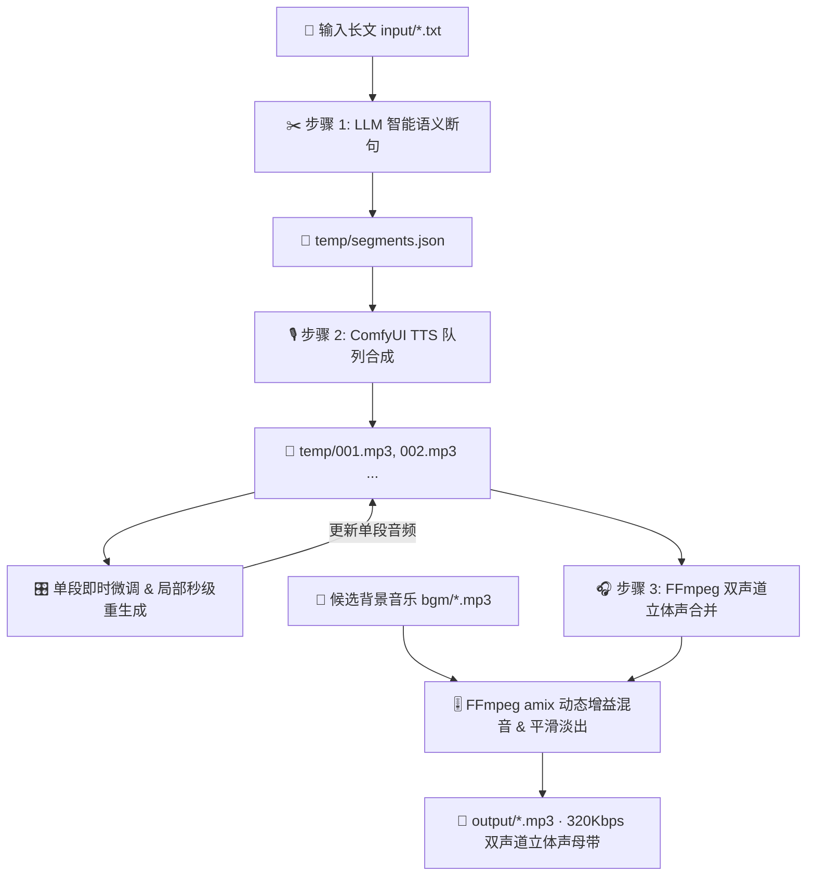

# 🎙️ TTS Studio - 现代化文章转语音智能工作台

<p align="center">
  
  
  
  
  
  
</p>

---

## 📖 项目简介 (Overview)

**TTS Studio** 是一套专为**万字长文、小说章节、播客与有声书制作**打造的现代化文章转语音全流程智能工作台。

传统长文本语音合成通常面临**生成超时、显存爆炸、单字读错需全文重跑、缺乏自然呼吸停顿、人声干瘪单薄**等痛点。TTS Studio 通过大语言模型智能分段、ComfyUI 语音生成、单段毫秒级调优重生成、320Kbps 双声道立体声母带合并以及背景音乐（BGM）智能混音，提供了一站式、工业级的有声制作体验。

提供 **现代化 Web 智能工作台** 与 **全功能 CLI 命令行** 两种使用模式。

---

## ✨ 核心特性 (Features)

### 1. ✂️ 步骤 1：智能语义分段 (LLM Smart Split)
- **语义精准断句**：自动调用大语言模型（兼容 OpenAI / 通义千问 / DeepSeek 等格式），在播客适读的自然语意断句处切分；
- **严格原文无损**：严密 Prompt 校验机制，严格保证不丢字、不加字、不改字；
- **字数弹性微调**：支持实时调节单段最大字数（100 ~ 300 字，默认 200 字）；
- **章节管理面板**：可视化文章列表、一键新建、原文在线编辑与 `.txt` 文件上传。

### 2. 🎛️ 步骤 2：分段微调与即时试听 (Segment Studio - 核心高频区)
- **一键自动跟听 (Auto-Follow Review)**：
  - 分段语音生成完毕后，点击「🎧 一键自动跟听」顺次连续试听全文分段；
  - 正在播放的段落卡片**动态呼吸高亮并自动平滑居中滚动聚焦**；
- **听音即时标记待修改 (Flag & Batch Remake)**：
  - 试听过程中发现发音瑕疵，只需点击悬浮条上的「🚩 标记待修改」或按下键盘 **`M` 键**，即可即时标记并同步勾选；
  - 支持键盘快捷键：`Space` 暂停/播放、`M` 标记/取消待修改、`←` / `→` 跳段、`Esc` 退出跟听；
  - 悬浮跟听控制台支持 1.0x / 1.25x / 1.5x / 2.0x 倍速切换、单段重听与进度监控；
  - 跟听结束后一键定位待修改段落、直接修改文字并「⚡ 一键批量重新生成待修改段落」；
- **单段即时编辑**：直接在段落卡片中修改文本（修正多音字、谐音字、调整标点停顿），修改后自动实时保存；
- **单段秒级重生成**：单个段落读错或音色不佳时，点击段落专属的「🎙️ 重新生成此段」，**秒级单独重跑该分段**并自动替换，无需重新跑整篇；
- **段落重组与自由调整**：支持段落合并（与下一段合并）、任意位置插入新段落、删除段落与批量勾选多段重新生成；
- **单段即时试听**：每个分段内置独立流式试听播放器与单段 MP3 下载。

### 3. 🎧 步骤 3：母带合成与背景音乐混音 (Mastering & BGM Studio)
- **双声道立体声 & 320Kbps 高保真输出**：
  - 自动将单声道语音映射并合并为标准的左右双声道立体声（Stereo 2.0 · 44.1kHz · 320Kbps MP3）；
- **段间呼吸停顿调节**：
  - 支持滑动条自由调节段间静音时长（0.2s ~ 3.0s，默认 1.0s），让整篇朗读听感自然舒适；
- **背景音乐库与智能混音系统 (BGM Playlist)**：
  - 备选背景音乐独立存放于 `bgm/` 文件夹，支持 Web 端一键上传与删除；
  - 播放列表流式卡片，解决长文件名挤压，自动探测并展示每首歌曲的精确时长（如 `06:16`）；
  - 行内单曲极简试听（Play/Pause），音量比例自由调节（1% ~ 50%，推荐 10%~20%）；
  - **FFmpeg 智能混音算法**：动态增益补偿保障人声 100% 原始饱满度，BGM 循环对齐并在结尾 2 秒平滑淡出；
- **现代化紧凑流式播放器**：
  - 毫秒级流式边下边播、实时进度拖动跳转、时间指示（`00:11 / 06:14`）、±5 秒快进快退与 0.75x ~ 2.0x 倍速播放；
  - 顶部显著的「⬇️ 下载完整母带」一键导出按钮。

### 4. 📊 实时控制台与系统诊断
- **WebSocket 实时流式控制台**：毫秒级回显 Python 管线、ComfyUI 任务排队、Prompt ID 与生成进度；
- **一键环境诊断**：可视化测试 LLM 连通性、ComfyUI 服务状态与 FFmpeg 环境。

---

## 📁 目录结构 (Directory Structure)

```plaintext
tts-project/
├── bgm/                  # 候选背景音乐文件夹（支持 mp3, wav, m4a, flac, aac, ogg）
├── docs/                 # 项目文档与指令说明
│   └── command.md        # 命令行操作与运行指南
├── input/                # 待处理的原文章节文本（*.txt）
├── output/               # 最终合成的 320Kbps 立体声母带音频（*.mp3）
├── temp/                 # 存放各章节的分段文本 (segments.json) 与单段音频 (001.mp3...)
├── static/               # 现代化 Web 前端静态资源
│   └── index.html        # 单文件现代化 Vue 3 + Tailwind CSS 智能工作台
├── workflows/            # ComfyUI 工作流模板文件
│   └── xiaoying-read.json
├── .env                  # 本地环境变量配置文件（API Key, ComfyUI 地址等）
├── .env.example          # 环境变量示例模版
├── start_web.ps1         # Windows PowerShell 一键启动脚本
├── tts_pipeline.py       # 核心音频处理与合成管线引擎 (CLI & Backend Engine)
├── web_app.py            # FastAPI Web 服务端与 WebSocket 实时推送
└── README.md             # 项目说明文档
```

---

## 🚀 快速上手 (Quick Start)

### 1. 环境准备
- **Python**: 3.10 或更高版本
- **FFmpeg**: 系统需安装 FFmpeg 并配置至环境变量 `PATH`
- **ComfyUI**: 本地已启动 ComfyUI 实例（默认 `http://127.0.0.1:8188`）并已加载 TTS 模型工作流

### 2. 安装依赖

```bash
# 激活项目虚拟环境（或新建虚拟环境）
.\venv\Scripts\activate

# 安装所需依赖
pip install fastapi uvicorn requests python-dotenv pydantic
```

### 3. 配置环境变量

复制 `.env.example` 为 `.env` 并填写相关参数：

```ini
# ── LLM 分段配置 ──
LLM_API_BASE=https://api.openai.com/v1   # 或兼容 OpenAI 格式的 API 地址
LLM_API_KEY=sk-your-api-key-here        # 你的 API Key
LLM_MODEL=gpt-4o-mini                   # 分段模型名称

# ── ComfyUI 配置 ──
COMFYUI_URL=http://127.0.0.1:8188       # ComfyUI 服务地址

# ── 音频与切分参数 ──
MAX_SEGMENT_CHARS=200                   # 每段最大字数
PAUSE_DURATION=1.0                      # 段间静音停顿秒数
```

---

## 💻 使用方式 (Usage)

### 方式一：Web 智能工作台（推荐，最直观便捷）

双击运行根目录下的 **`start_web.ps1`**（或在终端运行）：

```powershell
.\start_web.ps1
# 或者直接通过 Python 启动：
.\venv\Scripts\python.exe web_app.py
```

服务启动后将自动在浏览器中打开 **`http://127.0.0.1:8000`**。

#### 页面极简使用流程：
1. **左侧选择/新建文章**：输入或粘贴文章内容；
2. **步骤 1 (智能分段)**：点击「🚀 一键智能分段」调用 LLM 断句；
3. **步骤 2 (分段微调)**：点击「🎙️ 执行全部分段语音合成」生成各段音频，并在卡片中直接试听或对瑕疵段点击「重新生成此段」；
4. **步骤 3 (母带合成与混音)**：
   - 调节段间呼吸停顿时长（默认 1.0 秒）；
   - 在 BGM 播放列表中挑选背景音乐并调节音量；
   - 点击 **「🚀 一键生成完整母带 (320k 立体声)」**；
   - 在上方紧凑播放器中试听，点击 **「⬇️ 下载完整母带」** 导出成品！

---

### 方式二：CLI 命令行模式 (Command Line)

```bash
# 激活虚拟环境
.\venv\Scripts\activate.bat

# 1. 全流程一键生成（包含分段、合成、320k立体声合并与BGM混音）
python tts_pipeline.py --file 第8小节.txt --bgm "bgm/calm_piano.mp3" --bgm-volume 0.15

# 2. 单独重跑指定分段（如第 1、3、5 段），并自动重新合并最终母带
python tts_pipeline.py --step retts --segments 1,3,5 --file 第8小节.txt

# 3. 分阶段单步执行
python tts_pipeline.py --step split   # 仅分段
python tts_pipeline.py --step tts     # 仅合成语音
python tts_pipeline.py --step merge   # 仅音频合并 (320k立体声)
python tts_pipeline.py --step stereo  # 仅将已合并音频转为 320k 立体声
python tts_pipeline.py --step bgm --bgm "bgm/piano.mp3" --bgm-volume 0.15 --file 第8小节.txt  # 仅混入背景音乐
```

#### CLI 参数完整说明：

| 参数 | 缩写 | 默认值 | 说明 |
| :--- | :--- | :--- | :--- |
| `--file` | `-f` | `None` | 指定处理的章节文件名（如 `第8小节.txt`），省略则处理 `input/` 下所有文件 |
| `--step` | `-s` | `all` | 执行步骤：`all`, `split`, `tts`, `merge`, `retts`, `stereo`, `bgm` |
| `--segments` | | `None` | 指定需要重新生成的段落序号（如 `1,3,5` 或 `2`） |
| `--bgm` | | `None` | 背景音乐文件路径（如 `bgm/piano.mp3`） |
| `--bgm-volume` | | `0.15` | 背景音乐音量比例（`0.01` ~ `0.50`） |
| `--pause` | `-p` | `1.0` | 分段合并时的段间静音秒数 |
| `--stereo / --no-stereo`| | `True` | 是否合成为左右双声道立体声 |
| `--bitrate` | | `320k` | 输出 MP3 码率（推荐 `320k`） |
| `--speed` | | `0.95` | TTS 语速调节倍率 |

---

## 🛠️ 核心管线算法与设计 (Technical Architecture)



### 1. FFmpeg 左右双声道立体声映射
单声道语音经由 `[0:a][0:a]join=inputs=2:channel_layout=stereo[a]` 映射至左右双声道立体声，输出 `44100Hz · 320Kbps` 广播级 MP3。

### 2. FFmpeg BGM 混音增益补偿机制
标准 FFmpeg `amix=inputs=2` 会默认将各路音频衰减 1/2。TTS Studio 采用精细的滤镜链：
```bash
[0:a]volume=2.0,aformat=channel_layouts=stereo[voice];
[1:a]volume={bgm_volume * 2.0},aformat=channel_layouts=stereo[bgm];
[voice][bgm]amix=inputs=2:duration=first:dropout_transition=2[out]
```
保证**人声音量 100% 原始饱满**，BGM 循环匹配人声并在结尾 2 秒平滑淡出。

---

## ❓ 常见问题 (FAQ)

**Q1: ComfyUI 连接失败？**
> 请确保 ComfyUI 已在后台运行，并在 Web 界面右上角「⚙️ 系统设置」中检查 `COMFYUI_URL` 地址（默认 `http://127.0.0.1:8188`）是否一致。

**Q2: 提示 `ffprobe` 或 `ffmpeg` 找不到？**
> 请确保系统已安装 FFmpeg，并已将其 `bin` 路径添加至 Windows 系统环境变量 `PATH`。

**Q3: 如何添加自己的背景音乐？**
> 直接将音频文件（`.mp3`, `.wav`, `.m4a`, `.flac`）拖入项目的 `bgm/` 文件夹中，或在 Web 界面的「背景音乐库」中点击「上传新背景音乐」即可。

---

## 📄 开源许可证 (License)

本项目基于 [MIT License](LICENSE) 开源。欢迎 Star、Fork 与提交 PR！
